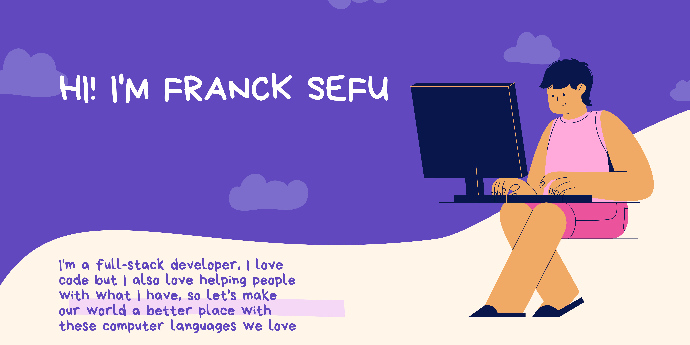

<h1> 👋 Hi, I’m Franck Sefu</h1>

 👀 Remote Full-Stack web developper ready for adventure <h2>😊</h2>
 
I am a software engineer passionate about all that is called 'improving the world through coding'. 
💞️Usually I program with  
<h3>FrontEnd : JavaScript, React, Next.js</h3>
<h3>BackEnd : Node (express), PHP, Ruby, Ruby on Rails</h3>
but note that I continue to improve my knowledge of AI to be able to implement it properly in project
  
<h2 style='color:blue;'> Contact me :</h2>
 
📫
 
 
 

 

